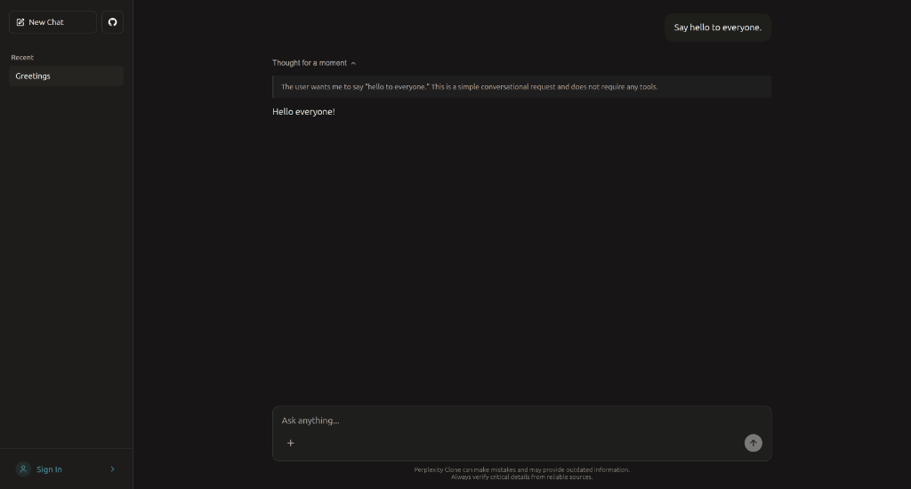

<!-- prettier-ignore -->
<div align="center">

# Perplexity Clone

_A developer-focused AI search engine featuring real-time response and tool-status streaming, chat-scoped RAG context isolation, and an intelligent Gmail/Tavily tool agent._

[](https://perplexity.aryanpatel.in) [](https://nodejs.org) [](https://react.dev) [](https://expressjs.com) [](https://socket.io) [](https://www.mongodb.com) [](https://redis.io)

[🚀 Live Demo](https://perplexity.aryanpatel.in) • [💻 Client Documentation](./client/README.md) • [⚙️ Server Documentation](./server/README.md) • [📑 API Reference](./server/API_REQUEST_RESPONSE_EXAMPLES.md) • [📦 Postman Workspace](https://www.postman.com/aryanpatel287-9653818/workspace/cohort2-0-backend/collection/47014706-4b0ef594-e434-465c-a382-87d22c11b4a5)

</div>

---

## 1. Project Overview

This repository contains a full-stack, decoupled clone of the Perplexity AI search engine. The application coordinates multiple LLMs (Google Gemini and Mistral AI) using LangChain to execute agentic workflows, including live web searches, document ingestion, and email transaction routing. Built to handle session boundaries seamlessly, it offers passwordless magic-link authentication with automatic migration of anonymous guest chats to registered user profiles upon signup.

---

## 2. Preview



> [!TIP]
> Try the live deployment at [perplexity.aryanpatel.in](https://perplexity.aryanpatel.in).

---

## 3. Why I Built This

This project was built to explore core engineering challenges in AI application architectures:
- **Connection Continuity**: Persisting intermediate streaming states (UI thinking indicators and active tool tags) across browser page refreshes without disrupting layout stability.
- **Context Security**: Enforcing strict multi-tenant access boundaries in shared vector indices to prevent data leaks across sessions.
- **Resource Constraints**: Structuring isolated document parsing queues with fallback pipelines to bypass heavy parser APIs (LlamaParse) for simple text and images, minimizing credit consumption.
- **System Failovers**: Wrapping external model APIs in resilient orchestration layers to handle rate limits and service outages gracefully.

---

## 4. Engineering Highlights

- **Real-Time Stream UI State Recovery**: Caches active stream status, accumulated thinking texts, and executing tool arrays in a Redis hash store (`streamTracker.service.js`). On page reload, the client queries `/api/chats/:chatId/active-stream` to recover active UI state seamlessly, avoiding rendering flickers or blank bubbles.
- **Chat-Scoped RAG Context Isolation**: Tags document chunks in Pinecone with `chatId` metadata and queries them using strict metadata context filters. RAW text chunks are resolved from MongoDB using indexed queries on `chatId` and `fileId`, preventing cross-chat document leaks.
- **Isolated & Cost-Optimized Ingestion**: Wraps batch file processing tasks inside isolated `try/catch` queues to prevent parser errors in a single file from halting the ingestion queue. Bypasses LlamaParse for image uploads and markdown files, parsing plain text/JSON via fallback scripts to conserve API credit limits.
- **Model Fallback Failover**: Coordinates Gemini (primary agent tools) and Mistral (embeddings and titles) via LangChain. A failover wrapper catches Gemini inference issues or rate limits, routing queries to a secondary `gemini-3.1-flash-lite` agent to maintain response continuity.
- **Automated Integration Testing & API Doc Gen**: Runs a 13-test Jest + Supertest integration suite in under 1.5 seconds. A capture harness intercepts HTTP responses during the test run, auto-compiling verified endpoints, request payloads, and response mock schemas into `API_REQUEST_RESPONSE_EXAMPLES.md`.

---

## 5. High-Level Architecture

```
┌────────────────────────────────────────────────────────────────────────┐
│                             React Client (SPA)                         │
│   ┌───────────────┐        ┌───────────────┐        ┌──────────────┐   │
│   │  Redux Store  │        │  Custom Hooks │        │  Socket.IO   │   │
│   │  (auth/chat)  │        │ (useAuth/Chat)│        │   Client     │   │
│   └───────┬───────┘        └───────┬───────┘        └──────┬───────┘   │
└───────────┼────────────────────────┼───────────────────────┼───────────┘
            │ HTTP (REST)            │ HTTP (REST)           │ WebSockets (Real-time Stream)
            ▼                        ▼                       ▼
┌────────────────────────────────────────────────────────────────────────┐
│                          Express 5 Server (Node.js)                    │
│   ┌────────────────────────────────────────────────────────────────┐   │
│   │                 Routes, Middleware & Controllers               │   │
│   │           (Auth, File Uploads, Session Managers, Security)     │   │
│   └────────────────────────────────┬───────────────────────────────┘   │
│                                    │                                   │
│                                    ▼                                   │
│   ┌────────────────────────────────────────────────────────────────┐   │
│   │                       LangChain AI Services                    │   │
│   │             (Gemini/Mistral Orchestrator & Tool Agents)        │   │
│   └────────────────────────────────┬───────────────────────────────┘   │
└────────────────────────────────────┼───────────────────────────────────┘
            ┌────────────────────────┼───────────────────────┐
            ▼                        ▼                       ▼
     ┌─────────────┐          ┌──────────────┐        ┌──────────────┐
     │   MongoDB   │          │   Pinecone   │        │    Redis     │
     │  (Metadata, │          │   (Vector    │        │   (Session,  │
     │   Chats)    │          │  Embeddings) │        │  Blacklist)  │
     └─────────────┘          └──────────────┘        └──────────────┘
            │                                                │
            ▼ (External APIs)                                ▼ (External APIs)
     ┌────────────────────────┐                      ┌───────────────┐
     │ ImageKit / LlamaParse  │                      │ Tavily Search │
     │ (File Parsing/Storage) │                      │ / Gmail API   │
     └────────────────────────┘                      └───────────────┘
```

HTTP REST endpoints manage system administration, session initialization, and file uploads, while bidirectional Socket.IO channels orchestrate real-time stream updates and agent thinking/tool execution events.

---

## 6. Tech Stack

| Layer | Technologies | Description |
|---|---|---|
| **Frontend** | React 19, Vite 7, Redux Toolkit, React Router v7, Sass/SCSS | Modular single-page app layout with scoped SCSS themes and responsive flex grid architectures. |
| **Backend** | Node.js (ESM), Express 5, Socket.IO | High-concurrency event-driven architecture hosting REST routing and WebSockets. |
| **Databases** | MongoDB (Mongoose 9), Pinecone, Redis | Multi-tier persistence: MongoDB for chats/files, Pinecone for vector context chunks, and Redis for stream tracking and session cache. |
| **AI Orchestration** | LangChain, Gemini API, Mistral API | Coordinates `gemma-4-31b-it` (reasoning/tools), `gemini-3.1-flash-lite` (failover), and `mistral-medium-latest` (metadata). |
| **Integrations** | LlamaCloud (LlamaParse), Tavily Search, ImageKit, Gmail API | Third-party interfaces for parsing documents, internet search access, asset hosting, and email transaction routing. |
| **Testing & Quality** | Jest, Supertest, Rollbar | Unit/integration validation with contract capturing and dynamic Rollbar error scrubbers. |

---

## 7. Documentation Architecture

This repository organizes documentation into three distinct layers to balance high-level readability with low-level implementation details:

```
Root README (This File)
    │   → Product-level overview & portfolio gateway (Recruiter-friendly)
    │   → Architectural boundaries, tech stack, and quick start path
    ▼
├── client/README.md
    │   → Detailed frontend documentation, React structure, and SCSS modules
    │   → Redux Toolkit chat states and Socket.IO client listeners
    ▼
└── server/README.md
        → Detailed backend documentation, RAG pipeline, and email routing logic
        → LangChain agent configuration, tool signatures, and ENV specifications
```

*   **API Reference Manual**: Review [API_REQUEST_RESPONSE_EXAMPLES.md](./server/API_REQUEST_RESPONSE_EXAMPLES.md) for complete endpoint parameters and response schemas auto-compiled from Jest integration tests.
*   **Postman Collection**: Import the local workspace payload [Perplexity_API_Collection.postman_collection.json](./server/Perplexity_API_Collection.postman_collection.json) directly into Postman to review mocked endpoints.

---

## 8. Quick Start

### Prerequisites
- Node.js LTS (v20 or higher)
- MongoDB Server
- Redis Server

### 1. Clone & Install
```bash
# Clone the repository
git clone https://github.com/aryanpatel287/peplexity-clone.git
cd peplexity-clone

# Install backend dependencies
cd server
npm install

# Install frontend dependencies
cd ../client
npm install
```

### 2. Configure Environment Files
- **Backend**: Copy `server/.env.example` to `server/.env` and supply the required API keys (MongoDB, Redis, Gemini, Mistral, Pinecone, Tavily, ImageKit, Llama Cloud, and Gmail OAuth credentials).
- **Frontend**: Copy `client/.env.example` to `client/.env` and update port numbers if custom configurations are used.

Refer to [server/README.md](./server/README.md) and [client/README.md](./client/README.md) for full parameter key descriptions.

### 3. Run Development Servers
- **Backend Server** (Terminal 1):
  ```bash
  cd server
  npm run dev
  ```
- **Frontend Client** (Terminal 2):
  ```bash
  cd client
  npm run dev
  ```
- Access the web interface at `http://localhost:5173`.
